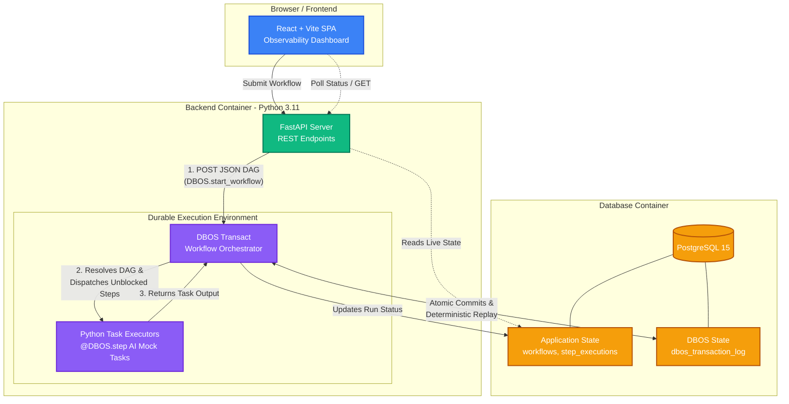

# Decisions

## 1. Alternatives Considered

During the architectural planning phase, several frameworks, languages, and design patterns were evaluated to fulfill the strict durability requirements of our AI pipeline and data extraction workloads.

---

### 1.1 Execution Engine & Orchestration

#### Alternative 1: Temporal (Heavyweight Durable Execution)

- **Design:** Deploying a Temporal Server cluster and writing Temporal "Workflows" and "Activities" to process the JSON execution.
- **Pros:** The enterprise gold standard for durable execution. Extremely robust observability dashboard and bulletproof crash recovery out of the box.
- **Cons:** High operational overhead. Temporal requires deploying and maintaining a complex cluster (Temporal Server, Cassandra/PostgreSQL, ElasticSearch). Furthermore, dynamically parsing arbitrary JSON DAGs at runtime is widely considered an anti-pattern in Temporal, which is heavily optimized for static, code-defined workflows.

#### Alternative 2: Traditional Task Queues (Celery / BullMQ / Redis)

- **Design:** Pushing the parsed DAG steps into a Redis-backed message queue, using primitives like Celery Chords or BullMQ Flows to manage the `depends_on` topological logic.
- **Pros:** Battle-tested, familiar to the engineering team, and easy to scale horizontally across workers.
- **Cons:** Standard message queues struggle with strict "exactly-once" semantics during worker crashes. If a worker completes an expensive LLM API call but dies before sending the ACK to Redis, the job will be re-queued and duplicated. Mapping dynamic, arbitrary JSON dependency graphs into static queue chains also frequently results in brittle, difficult-to-maintain orchestration code.

#### Alternative 3: Custom State Machine (FastAPI + SQL Transactions)

- **Design:** Building a custom background worker loop that queries a SQL database for pending steps, using strict `SELECT ... FOR UPDATE` locks to transition step states safely across concurrent workers.
- **Pros:** Highly transparent. Zero external library dependencies for the execution engine.
- **Cons:** Reinvents the wheel. Building, testing, and maintaining custom edge-case-free state recovery, lock-leasing, and retry logic represents an unnecessary engineering burden when modern libraries natively solve this problem at the database layer.

#### 🏆 Final Decision: DBOS Transact

We chose **DBOS Transact** backed by PostgreSQL. DBOS hit the perfect intersection of our requirements. It provides the "exactly-once" crash-recovery capability of Temporal by leveraging standard PostgreSQL transactions, eliminating the risk of duplicated tasks without the operational burden of a massive orchestrator cluster. It allows us to keep the infrastructure simple while guaranteeing state persistence across container failures.

---

### 1.2 Backend Language Selection

#### Alternative: TypeScript (Node.js)

- **Pros:** End-to-end type safety across the entire stack. Defining DAG interfaces in a shared `types.ts` file allows strict contract validation between the React frontend and the backend API.
- **Cons:** The AI and data processing ecosystem is less mature. While Node.js support is growing, integrating complex data extraction pipelines or native AI libraries often requires workarounds, second-party wrappers, or bridging to Python microservices.

#### 🏆 Final Decision: Python

We selected **Python** as the primary language for the execution engine.

Because our core use case involves executing LangChain-based agentic workflows and routing dynamically generated prompts to local LLM environments like Ollama, Python is the undisputed industry standard. It provides frictionless, native integration with these specific AI ecosystems without requiring intermediary APIs.

Furthermore, Python's clean dictionary comprehensions and set operations make parsing the arbitrary JSON DAG and implementing the topological sort (Kahn's algorithm) highly readable. The DBOS Python SDK natively wraps these blocking AI I/O calls safely inside its `@DBOS.step()` decorators, preventing them from locking the execution loop while guaranteeing their outcomes are durably journaled in PostgreSQL.

---

### 1.3 Frontend Observability & State Synchronization

To fulfill the observability requirements for the UI, we evaluated how to synchronize live workflow state and how to best visualize the DAG execution for operators.

#### Alternative: WebSockets and 2D Node-Graph Visualization

- **Design:** Establishing a persistent WebSocket connection between the React client and the FastAPI backend to stream state changes, while using a canvas-based library like React Flow to render a fully interactive 2D node graph of the DAG.
- **Pros:** Pushes instantaneous state updates to the client with zero polling overhead. A 2D node graph provides a highly impressive, visual representation of complex parallel dependencies.
- **Cons:** WebSockets introduce significant complexity regarding connection drops and reconnect logic. Given that the core purpose of this system is to survive hard server crashes (`SIGKILL`), maintaining and recovering stateful socket connections during a container failure is an unnecessary point of fragility for a V1 internal tool. Furthermore, 2D graph libraries require substantial boilerplate and layout calculation logic, slowing down time-to-delivery.

#### 🏆 Final Decision: REST Short-Polling and Timeline UI (React + Tailwind)

We opted to build the UI using **React** and **Tailwind CSS**, utilizing stateless HTTP short-polling and a chronological timeline view for the execution state.

**Why we chose it:** Because DBOS securely manages execution state via PostgreSQL transactions, short-polling a `GET /api/workflows/{id}/state` endpoint every 1000ms is highly resilient and perfectly suited for this architecture. If the backend container crashes and restarts, the frontend simply continues its polling loop without needing to re-establish a socket handshake or manage connection state.

For the visualization, we prioritized functional clarity over UI complexity. A structured, color-coded list or vertical timeline grouped by topological execution tiers allows operators to easily read the execution chronologically. When debugging failed LLM prompts or broken data extraction steps, reading a top-down execution log is often faster and more intuitive than navigating a complex 2D canvas.

---

## 2. Limitations & Future Work

While the V1 architecture successfully guarantees exactly-once execution and fulfills the core durability requirements, there are known limitations and areas for future optimization.

### 2.1 Current Limitations

- **Database Bottleneck:** Because DBOS uses PostgreSQL for both application state and internal deterministic replay tracking, the database is the primary bottleneck. Under a massive load of highly parallel, short-lived tasks, the transaction overhead could lead to database lock contention and IOPS limits.
- **Polling Latency:** Relying on HTTP short-polling (every 1000ms) means the frontend visualization is technically delayed by up to one second. While acceptable for a V1 internal tool monitoring long-running AI tasks, it is not perfectly real-time.
- **Synchronous Execution Environment:** Currently, the `@DBOS.workflow` execution loop evaluates the DAG and calls steps sequentially or via standard asynchronous gathers on the same node handling the API request. It is not currently delegating tasks to a distributed cluster of worker nodes.

### 2.2 What We Would Do Differently With More Time

If this were expanded beyond a 48-hour prototype, the following features would be prioritized for V2:

1. **Distributed Worker Pool Integration:** Instead of running the `@DBOS.step()` functions on the primary web server, we would decouple the DAG traversal from the actual task execution. The workflow loop would simply drop task configurations into an optimized internal queue or use horizontal DBOS workers, allowing highly parallel DAG steps to be executed across multiple distinct physical nodes.

2. **Step-Level Retries with Exponential Backoff:** Currently, a failure in a step (e.g., a 503 from an external LLM provider) might halt the DAG. We would implement robust `@DBOS.step(retries=3)` configurations with exponential backoff to handle transient network errors gracefully before marking a step as `FAILED`.

---

## 3. System Architecture

